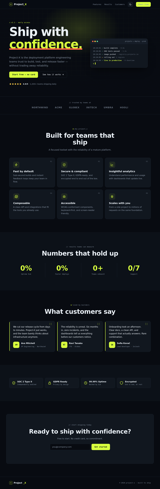

# Project-X

A distinctive, dependency-free marketing site for a developer platform, built
with plain HTML, CSS, and vanilla JavaScript — no framework, no build step.

The design follows an **"engineering blueprint"** direction: a dark technical
canvas (with a light "blueprint on paper" variant), a blueprint grid, an electric
lime signature accent, a live deploy-console hero motif, and characterful
typography (Bricolage Grotesque · IBM Plex Sans · JetBrains Mono).



## Run it

Open `index.html` directly, or serve the folder:

```sh
python3 -m http.server 8000   # http://localhost:8000
```

## Structure

| Path | Role |
|------|------|
| `index.html` | Markup and content (hero, logos, features, metrics, testimonials, trust, CTA) |
| `styles.css` | Design tokens, both themes, layout, motion, responsive rules |
| `script.js` | Theme toggle, mobile nav, scroll reveals, console reveal, stat counters, form validation |
| `.claude/skills/` | Installed design-intelligence skills (see below) |
| `src/ui-ux-pro-max/` | Searchable design database + scripts backing the skill |
| `preview-*.png` | Rendered previews (dark / light / mobile) |

## How the design was made

Two skills were combined:

- **`ui-ux-pro-max`** (installed from
  [nextlevelbuilder/ui-ux-pro-max-skill](https://github.com/nextlevelbuilder/ui-ux-pro-max-skill))
  — supplied the structure and engineering: the social-proof landing pattern, a
  SaaS-grade semantic token set, the type scale, spacing, motion durations, and
  the accessibility rules (WCAG contrast, 44px touch targets, focus states,
  `prefers-reduced-motion`, SVG icons over emoji). Query it with:

  ```sh
  python3 .claude/skills/ui-ux-pro-max/scripts/search.py "landing page" --domain style
  ```

- **`frontend-design`** (system skill) — pushed past the generic default look:
  the committed blueprint aesthetic, distinctive fonts, a dominant color with a
  sharp accent, grain/grid atmosphere, and the deploy-console signature element.

## Regenerate the previews

```sh
python3 -m http.server 8099 &
node /tmp/shot2.js     # Playwright capture script (dark / light / mobile)
```

## Deploy

Push the static files to any host (GitHub Pages, Netlify, Vercel, S3).
